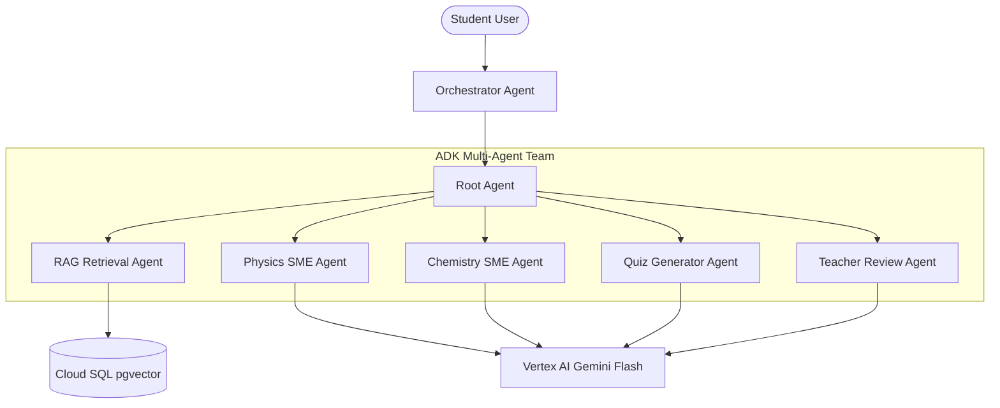
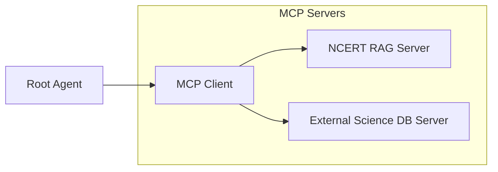

# StudyMateAI - Architecture Vision & Multi-Agent Design

This document details the target architecture, multi-agent coordination structure, and future integration roadmaps for StudyMateAI.

## 1. Multi-Agent System (ADK Target Architecture)

The system is built on a hierarchical multi-agent coordination pipeline, moving orchestration logic out of monolithic service files into dedicated Agent layers powered by the Google Agent Development Kit (ADK).

### 1.1 Agent Hierarchy & Descriptions
- **Orchestrator / Root Agent**: Validates safety inputs (Prompt Guard), extracts intents (doubt-solving, summaries, quiz request), and handles routing pipeline execution.
- **RAG Retrieval Agent**: Programmatically reads textbook and curriculum knowledge coordinates, retrieving top-3 contextual chunks.
- **Physics & Chemistry SMEs**: Subject Matter Expert agents responsible for formatting explanations, formulas, and textbook references.
- **Quiz Generator Agent**: Generates 5 multiple-choice questions matching syllabus parameters.
- **Teacher Review Agent**: Gates generated responses before user delivery. Evaluates scores, checks safety boundaries, and flags factual anomalies.

---

## 2. Model Context Protocol (MCP) Integration Pathway

In future stages, external knowledge sources and third-party databases (such as Wikipedia, Wolfrum Alpha, or external math systems) will be integrated using Model Context Protocol (MCP) server configurations.

- **NCERT RAG Server**: Exposes resources for textbook chapters and tool functions for semantic vector searches.
- **External Science DB Server**: Enables real-time lookups of physical constants, chemical reactions, and compound structures.
- **Protocol Benefits**: Decouples SME agents from hardcoded REST databases, enforcing a standardized client-server tool execution boundary.
