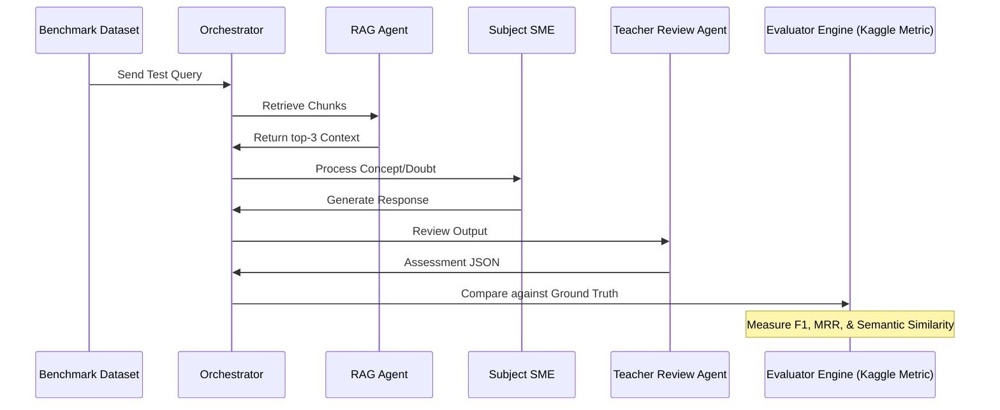

# Kaggle Evaluation Mapping - StudyMateAI

This document maps the architectural capabilities of the StudyMateAI multi-agent system directly to evaluation metrics and benchmarks typical of Kaggle Capstone challenges.

## 1. Evaluation Dimension Matrix

| Agent / Workflow Component | Kaggle Evaluation Metric | Grounding Metric / Objective |
| :--- | :--- | :--- |
| **Orchestrator Agent** | Classification F1-Score | Correct classification of intent (e.g., `doubt_solving` vs. `quiz_generation`) and subject routing. |
| **RAG Agent** | Retrieval Recall @ 3 & MRR | Hits containing correct formula or textbook content for the selected subject and year. |
| **Physics / Chemistry SMEs** | BLEU / ROUGE / Semantic Similarity | Readability, teacher-like explanation accuracy, and formula presence. |
| **Teacher Review Agent** | Factual Consistency & Hallucination Rate | Automated check by LLM reviewing whether generated output contains facts not present in retrieved RAG context. |
| **Quiz Generator Agent** | MCQ Quality Ratio | Validity of generated options (distractors), correct answer alignment, and quality of explanation. |

---

## 2. Benchmark Dataset Targets
We map our MVP testing to the following open-science dataset categories:
1. **NCERT Textbook Chunks**: Baseline text corpus for RAG vector search, mapped to retrieval accuracy.
2. **NEET & KCET Solved Questions**: Ground-truth questions for validation of both the MCQ generator and the Teacher Review Agent grading accuracy.
3. **MMLU (Massive Multitask Language Understanding)**: Specifically targeting Physics and Chemistry subcategories to measure baseline SME reasoning performance.

---

## 3. Evaluation Pipelines

